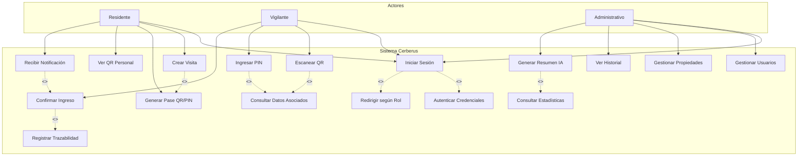
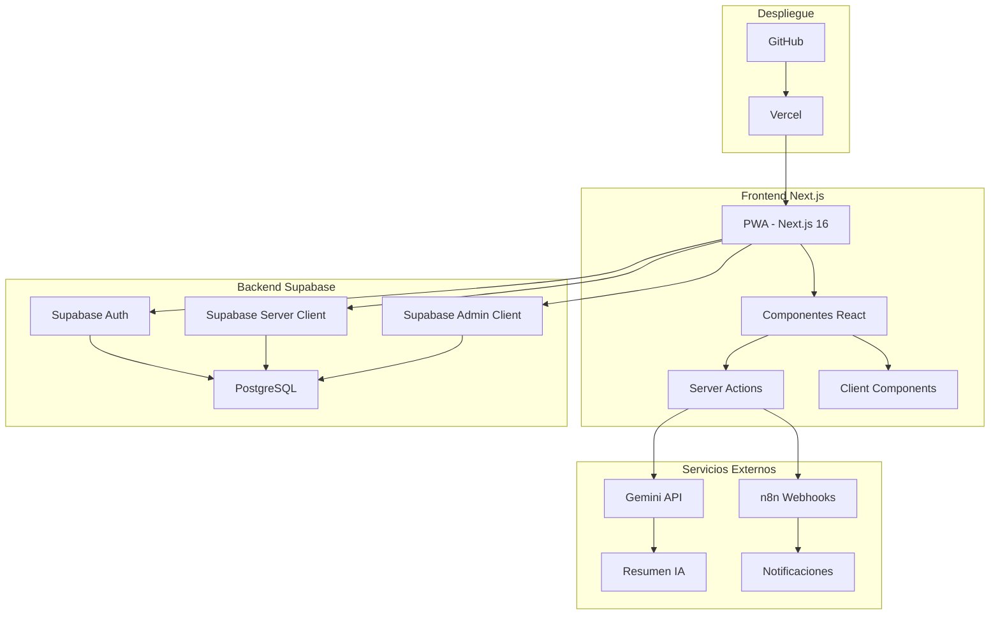
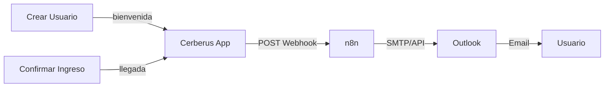

# PROYECTO PLANIFICACIÓN BAJO METODOLOGÍA ÁGIL
## SISTEMA DE CONTROL DE ACCESO PARA CONDOMINIOS

**Docente:** Ing. Dubraska Roca  
**Alumnos:** Daniel Villalba Santamaría V-27.506.542  

**CIUDAD GUAYANA, SEPTIEMBRE DEL 2026.**

---

## Índice

1. [Planteamiento del Problema y Proceso de Elicitación](#1-planteamiento-del-problema-y-proceso-de-elicitación)
2. [Requisitos Funcionales y No Funcionales](#2-requisitos-funcionales-y-no-funcionales)
3. [Historias de Usuario](#3-historias-de-usuario)
4. [Gestión del Control de Calidad del Software](#4-gestión-del-control-de-calidad-del-software)
5. [Diagramas de Caso de Uso](#5-diagramas-de-caso-de-uso)
6. [Uso de Inteligencia Artificial](#6-uso-de-inteligencia-artificial)
7. [Prototipo UI/UX](#7-prototipo-uiux)
8. [Arquitectura General de la Aplicación](#8-arquitectura-general-de-la-aplicación)
9. [Arquitectura de la Base de Datos](#9-arquitectura-de-la-base-de-datos)
10. [Automatizaciones n8n](#10-automatizaciones-n8n)
11. [Link del Repositorio](#11-link-del-repositorio)
12. [Capturas de las Pantallas de la Aplicación](#12-capturas-de-las-pantallas-de-la-aplicación)

---

## 1. Planteamiento del Problema y Proceso de Elicitación

### 1.1 Contexto

Los condominios residenciales enfrentan desafíos constantes en el control de acceso de visitantes y proveedores. Los métodos tradicionales, como llamadas telefónicas al residente y registros manuales en bitácoras de papel, generan congestión en las porterías y brechas de seguridad que afectan la calidad de vida de los residentes.

### 1.2 Problema

El problema principal se divide en dos áreas críticas:

**Congestión en Porterías**

| Problema | Impacto | Frecuencia |
| :--- | :--- | :--- |
| Colas de vehículos en horas pico | Retraso para residentes | Diaria |
| Registro manual de visitantes y vehículos | Ineficiencia operativa | Continua |
| Llamadas telefónicas no contestadas | Visitantes esperando | Frecuente |
| Registros ilegibles en papel | Pérdida de información | Periódica |

**Falta de Trazabilidad**

| Problema | Consecuencia |
| :--- | :--- |
| Sin registro digital | No se puede consultar quién visitó el condominio |
| Sin notificaciones | Residentes no saben cuándo llegan sus visitantes |
| Sin auditorías | Imposible generar reportes de seguridad |
| Sin control de proveedores | Brechas de seguridad por falta de registro |

### 1.3 Alcance y solución propuesta

El alcance se centra en el flujo de autorización y validación de visitas, y en el acceso de residentes mediante un código personal permanente.

La aplicación web responsiva utiliza un enfoque híbrido de **QR + PIN de respaldo**. El residente genera un pase temporal con los datos del visitante y el sistema produce un QR y un PIN. El vigilante puede validar cualquiera de los dos métodos, revisar los datos asociados y confirmar el ingreso. La administración puede consultar los accesos registrados.

Quedan fuera del alcance las talanqueras automáticas, los módulos de cobro de alícuotas y la reserva de áreas comunes.

### 1.4 Proceso de Elicitación

El proceso de elicitación se realizó con un enfoque académico y exploratorio, orientado a identificar las necesidades principales del control de acceso en condominios y traducirlas en requisitos funcionales verificables.

#### Métodos de Elicitación Utilizados

| Método | Descripción | Resultado |
| :--- | :--- | :--- |
| **Entrevistas** | Conversaciones con residentes y personal de portería para identificar problemas actuales. | Identificación de congestión en horas pico y falta de trazabilidad. |
| **Observación directa** | Revisión del flujo de acceso en portería durante diferentes horarios. | Identificación de demoras asociadas al registro manual de visitantes y vehículos. |
| **Análisis documental** | Revisión de bitácoras de papel y registros existentes. | Identificación de registros ilegibles y pérdida de información. |
| **Benchmarking** | Análisis de soluciones similares en el mercado. | Decisión de usar una aplicación web responsiva con enfoque híbrido QR+PIN. |

#### Actores Identificados

| Actor | Rol | Necesidades principales |
| :--- | :--- | :--- |
| **Residente** | Usuario que autoriza visitas | Crear pases rápidamente y acceder al condominio. |
| **Vigilante** | Personal de portería | Validar accesos rápidamente con una interfaz móvil simple. |
| **Administrativo** | Personal de administración | Gestionar usuarios y auditar accesos. |

#### Flujos de Usuario Identificados

1. **Flujo de Login:** autenticación por rol y redirección al dashboard correspondiente.
2. **Flujo de Creación de Visita:** formulario, generación QR/PIN y visualización del pase para entregarlo al visitante.
3. **Flujo de Validación en Portería:** escaneo QR o ingreso de PIN, validación, visualización de datos y confirmación de ingreso.
4. **Flujo de Acceso del Residente:** QR/PIN personal, validación y registro del ingreso del residente.
5. **Flujo de Administración:** gestión de usuarios y propiedades, seguida de consulta de información actualizada.
6. **Flujo de Notificación:** confirmación de llegada, webhook n8n y envío de correo al residente.
7. **Flujo de Resumen Diario:** consulta de datos, cálculo de estadísticas y generación de resumen con Gemini o fallback local.
8. **Flujo de Expiración:** visita pendiente con fecha anterior y actualización automática al estado expirado.
9. **Flujo de Auditoría:** consulta del historial con filtros por fecha y tipo de visita.

#### Trazabilidad entre Necesidades y Requisitos

| Necesidad identificada | Requisito relacionado |
| :--- | :--- |
| Reducir llamadas y demoras en la portería | **RF-04:** validación de ingreso mediante QR o PIN. |
| Registrar digitalmente los accesos | **RF-06:** registro de fecha, hora y vigilante responsable. |
| Consultar las actividades anteriores | **RF-08:** historial global filtrable para administración. |
| Notificar la llegada de visitantes | **RF-07a:** notificación automatizada al residente. |
| Facilitar el acceso de los residentes | **RF-02b:** QR y PIN personal permanente. |
| Evitar depender exclusivamente de la cámara | **RF-03 y RF-04:** pase híbrido y validación mediante PIN. |
| Obtener una lectura rápida de la actividad diaria | **RF-05:** resumen diario generado con IA. |

---

## 2. Requisitos Funcionales y No Funcionales

### 2.1 Requisitos Funcionales

| ID | Requisito | Descripción |
| :--- | :--- | :--- |
| **RF-01** | Autenticación | El sistema debe permitir el inicio de sesión basado en roles usando correo y contraseña. |
| **RF-02** | Gestión de Pases | El residente debe poder generar un pase temporal con datos del visitante, fecha, tipo y vehículo. |
| **RF-02b** | Acceso Residente | El residente debe disponer de un código QR y PIN personal permanente. |
| **RF-03** | Pase Híbrido | El sistema debe generar automáticamente un código QR y un PIN alfanumérico por cada pase. |
| **RF-04** | Validación de Ingreso | El vigilante debe poder validar un pase mediante QR o PIN, revisar los datos asociados y confirmar el ingreso. |
| **RF-05** | Analítica con IA | El sistema debe generar un resumen diario de actividad en lenguaje natural mediante Gemini API. |
| **RF-06** | Trazabilidad | El sistema debe registrar la fecha, hora exacta y vigilante responsable al confirmar un ingreso. |
| **RF-07a** | Notificación de llegada | El sistema debe emitir una alerta automatizada al residente cuando llegue su invitado. |
| **RF-07b** | Email de bienvenida | El sistema debe enviar un email de bienvenida con credenciales al crear un usuario nuevo. |
| **RF-08** | Auditoría | El personal administrativo debe poder consultar y filtrar el historial global de accesos. |

### 2.2 Requisitos No Funcionales

| ID | Requisito | Descripción |
| :--- | :--- | :--- |
| **RNF-01** | Accesibilidad | La solución debe ser una aplicación web responsiva para celulares y escritorio. |
| **RNF-02** | Rendimiento | El tiempo de respuesta para la validación de un pase no debe exceder 2 segundos como objetivo funcional. |
| **RNF-03** | Seguridad | Next.js Middleware valida la sesión, el rol y el acceso a las rutas protegidas. |
| **RNF-04** | Usabilidad | La interfaz del vigilante debe poseer botones sobredimensionados, de mínimo 56px de alto. |
| **RNF-05** | Disponibilidad | La arquitectura serverless debe soportar el uso concurrente durante las horas de mayor actividad. |

---

## 3. Historias de Usuario

Las historias de usuario se organizaron mediante Scrum y se redactaron utilizando el formato **Given-When-Then** para facilitar la validación funcional. El backlog contiene 21 historias distribuidas en cuatro Sprints.

| ID | Sprint | Título | Historia de Usuario | Criterio de Aceptación (Gherkin) |
| :--- | :---: | :--- | :--- | :--- |
| **HU-01** | 1 | Inicialización del Frontend | **Como** desarrollador, quiero inicializar Next.js y Tailwind CSS para establecer la estructura del frontend. | **Given** un entorno limpio<br>**When** inicio el proyecto<br>**Then** visualizo la aplicación. |
| **HU-02** | 1 | Configuración de BD | **Como** desarrollador, quiero crear el proyecto Supabase y aplicar el modelo de datos para habilitar la persistencia. | **Given** la consola de Supabase disponible<br>**When** aplico el esquema SQL<br>**Then** las tablas se reflejan correctamente. |
| **HU-03** | 1 | CI/CD | **Como** líder técnico, quiero enlazar GitHub con Vercel para desplegar automáticamente. | **Given** un cambio en la rama principal<br>**When** realizo push<br>**Then** Vercel compila y publica los cambios. |
| **HU-04** | 1 | Prueba Cloud | **Como** administrador, quiero acceder a la URL pública para verificar la infraestructura. | **Given** el pipeline exitoso<br>**When** ingreso a la URL<br>**Then** la aplicación carga correctamente. |
| **HU-05** | 2 | Login de Usuarios | **Como** usuario, quiero iniciar sesión con mis credenciales para acceder a las funciones correspondientes a mi rol. | **Given** la página de login<br>**When** ingreso credenciales válidas<br>**Then** soy redirigido al dashboard correspondiente. |
| **HU-06** | 2 | Protección de Rutas | **Como** usuario autenticado, quiero que las rutas se protejan según mi rol para mantener seguros los datos. | **Given** una sesión inválida o inexistente<br>**When** accedo a una ruta protegida<br>**Then** soy redirigido al login. |
| **HU-07** | 2 | Dashboard Residente | **Como** residente, quiero visualizar mis invitaciones activas para gestionar mis próximos invitados. | **Given** una sesión de residente<br>**When** cargo el dashboard<br>**Then** veo mis invitaciones activas. |
| **HU-08** | 2 | Registrar Visita | **Como** residente, quiero llenar los datos del visitante para autorizar una visita. | **Given** el formulario de nueva visita<br>**When** completo los datos y guardo<br>**Then** la visita queda registrada como pendiente. |
| **HU-09** | 2 | Pase Híbrido | **Como** residente, quiero generar un pase híbrido para disponer de QR y PIN. | **Given** una visita registrada<br>**When** proceso el pase<br>**Then** se muestran el QR y el PIN asociados. |
| **HU-10** | 3 | UI en Portería | **Como** vigilante, quiero una vista móvil optimizada para operar fácilmente estando de pie. | **Given** el acceso desde un dispositivo móvil<br>**When** cargo el panel<br>**Then** visualizo botones grandes y responsivos. |
| **HU-11** | 3 | Escáner QR | **Como** vigilante, quiero escanear un QR para validar la entrada de visitantes o residentes. | **Given** el escáner activo<br>**When** enfoco un código válido<br>**Then** se muestran los datos y se registra el ingreso correspondiente. |
| **HU-12** | 3 | PIN Manual | **Como** vigilante, quiero validar un PIN si el QR falla para registrar el ingreso. | **Given** la vista manual<br>**When** ingreso un PIN válido<br>**Then** se muestran los datos y se registra el ingreso. |
| **HU-13** | 3 | Resumen IA | **Como** administrativo, quiero ver un resumen diario generado por IA para entender las tendencias. | **Given** una sesión administrativa<br>**When** solicito el resumen<br>**Then** se muestra la actividad diaria procesada. |
| **HU-14** | 3 | Notificaciones n8n | **Como** sistema, quiero enviar emails automatizados para notificar bienvenida y llegada. | **Given** un usuario creado o una visita ingresada<br>**When** se ejecuta la acción<br>**Then** n8n procesa el correo correspondiente. |
| **HU-15** | 3 | Historial de Accesos | **Como** administrativo, quiero consultar el historial de ingresos con tipo de visita para auditar la seguridad. | **Given** una sesión administrativa<br>**When** accedo al historial y aplico filtros<br>**Then** veo los accesos coincidentes. |
| **HU-16** | 4 | Control de Calidad | **Como** responsable de QA, quiero ejecutar 24 pruebas funcionales manuales para verificar el cumplimiento de los criterios de aceptación. | **Given** el sistema y los datos de prueba preparados<br>**When** ejecuto los 24 casos definidos<br>**Then** registro resultados, evidencias y observaciones. |
| **HU-17** | 2 | QR/PIN Personal | **Como** residente, quiero tener un código QR y PIN personal permanente para acceder sin pase temporal. | **Given** una sesión de residente<br>**When** accedo a Mi QR<br>**Then** veo mi código personal. |
| **HU-18** | 3 | Gestión de Usuarios | **Como** administrativo, quiero registrar, editar y eliminar usuarios para gestionar el sistema. | **Given** una sesión administrativa<br>**When** accedo a Usuarios<br>**Then** puedo realizar las operaciones de gestión. |
| **HU-19** | 3 | Gestión de Propiedades | **Como** administrativo, quiero administrar las unidades para asignarlas a residentes. | **Given** una sesión administrativa<br>**When** accedo a Propiedades<br>**Then** puedo crear, editar y eliminar unidades. |
| **HU-20** | 2 | Historial Personal Vigilante | **Como** vigilante, quiero consultar mis ingresos validados para auditar mi actividad. | **Given** una sesión de vigilante<br>**When** accedo a Mi Historial<br>**Then** solo veo los ingresos validados por mí. |
| **HU-21** | 3 | Transición de Login | **Como** usuario, quiero ver una transición con el logo al iniciar sesión para acceder al dashboard con una experiencia fluida. | **Given** credenciales válidas<br>**When** el sistema autentica al usuario<br>**Then** se muestra la transición y después el dashboard. |

### Estado de los Sprints

| Sprint | Alcance | Estado |
| :--- | :--- | :--- |
| **Sprint 1** | Configuración, base de datos y despliegue | Completado |
| **Sprint 2** | Autenticación y funcionalidades del residente | Completado |
| **Sprint 3** | Control de acceso, notificaciones y administración | Completado |
| **Sprint 4** | Control de calidad y pruebas funcionales manuales | Pendiente |

**Avance total:** 20/21 HU completadas (95%).

---

## 4. Gestión del Control de Calidad del Software

### 4.1 Estrategia de Calidad

La validación se realizará manualmente y se enfocará en el comportamiento funcional visible de la aplicación. Por el alcance académico, no se incluyen pruebas automatizadas con Cypress, pruebas de carga ni pruebas de seguridad avanzada.

| Aspecto | Estrategia |
| :--- | :--- |
| Pruebas funcionales manuales | Validación de los flujos principales con usuarios y datos de prueba. |
| Integración funcional | Verificación manual de los flujos login → crear visita → validar acceso. |
| Revisión de código | Análisis estático con TypeScript y ESLint. |
| Compilación | Ejecución de `npm run build`. |
| Evidencias | Capturas de pantalla, observaciones y resultados por caso. |

### 4.2 Plan de Pruebas Funcionales

| ID | Módulo | Caso de prueba | Resultado esperado | Resultado obtenido | Estado | Evidencia |
| :--- | :--- | :--- | :--- | :--- | :--- | :--- |
| PF-01 | Login | Credenciales válidas de residente | Dashboard de residente | Pendiente | Pendiente | Pendiente |
| PF-02 | Login | Credenciales válidas de vigilante | Panel de portería | Pendiente | Pendiente | Pendiente |
| PF-03 | Login | Credenciales válidas de administrador | Panel administrativo | Pendiente | Pendiente | Pendiente |
| PF-04 | Login | Credenciales incorrectas | Mensaje de error y acceso rechazado | Pendiente | Pendiente | Pendiente |
| PF-05 | Login | Autenticación válida | Transición visual con el logo | Pendiente | Pendiente | Pendiente |
| PF-06 | Rutas | Acceder sin sesión a una ruta protegida | Redirección al login | Pendiente | Pendiente | Pendiente |
| PF-07 | Residente | Crear visita con datos válidos | Visita registrada como pendiente | Pendiente | Pendiente | Pendiente |
| PF-08 | Residente | Generar pase | QR y PIN asociados visibles | Pendiente | Pendiente | Pendiente |
| PF-09 | Residente | Consultar QR personal | QR y PIN permanente visibles | Pendiente | Pendiente | Pendiente |
| PF-10 | Vigilante | Escanear QR de visitante | Datos de la visita visibles | Pendiente | Pendiente | Pendiente |
| PF-11 | Vigilante | Validar PIN de visitante | Datos visibles e ingreso registrado | Pendiente | Pendiente | Pendiente |
| PF-12 | Vigilante | Validar QR de residente | Ingreso del residente registrado | Pendiente | Pendiente | Pendiente |
| PF-13 | Vigilante | Validar PIN inválido | Mensaje de código no encontrado | Pendiente | Pendiente | Pendiente |
| PF-14 | Notificaciones | Confirmar ingreso de visitante | Flujo de notificación ejecutado | Pendiente | Pendiente | Pendiente |
| PF-15 | Historial admin | Consultar historial global | Accesos registrados visibles | Pendiente | Pendiente | Pendiente |
| PF-16 | Historial admin | Filtrar por fecha y tipo | Solo registros coincidentes | Pendiente | Pendiente | Pendiente |
| PF-17 | Historial vigilante | Consultar historial personal | Solo ingresos del vigilante | Pendiente | Pendiente | Pendiente |
| PF-18 | Usuarios | Crear usuario | Usuario registrado con su rol | Pendiente | Pendiente | Pendiente |
| PF-19 | Usuarios | Editar usuario | Cambios reflejados | Pendiente | Pendiente | Pendiente |
| PF-20 | Usuarios | Eliminar usuario | Usuario ausente del listado | Pendiente | Pendiente | Pendiente |
| PF-21 | Propiedades | Crear propiedad | Unidad visible en el listado | Pendiente | Pendiente | Pendiente |
| PF-22 | Propiedades | Editar o eliminar propiedad | Cambio reflejado | Pendiente | Pendiente | Pendiente |
| PF-23 | IA | Generar resumen diario | Resumen Gemini o fallback local visible | Pendiente | Pendiente | Pendiente |
| PF-24 | Expiración | Consultar visita con fecha pasada | Estado expirado visible | Pendiente | Pendiente | Pendiente |

### 4.3 Procedimiento de Ejecución

Las pruebas se ejecutarán manualmente utilizando usuarios, propiedades y visitas de prueba. Se seguirán estos grupos:

1. PF-01 a PF-06: autenticación y protección de rutas.
2. PF-07 a PF-09: funcionalidades del residente.
3. PF-10 a PF-14: validación de accesos y notificaciones.
4. PF-15 a PF-17: historiales.
5. PF-18 a PF-22: administración.
6. PF-23 a PF-24: IA y expiración.

Cada caso registrará resultado obtenido, estado, evidencia y observaciones. Los estados permitidos serán **Pendiente**, **Aprobado**, **Fallido** y **No aplica**.

### 4.4 Criterios de Aceptación

- Los 24 casos funcionales deben ser ejecutados y documentados.
- Cada caso aprobado debe contar con evidencia.
- Los flujos críticos no deben presentar errores bloqueantes.
- Los casos fallidos deben incluir observaciones y seguimiento.

---

## 5. Diagramas de Caso de Uso

### 5.1 Diagrama General



### 5.2 Casos de Uso por Actor

**Residente:** iniciar sesión, crear visita, generar pase, consultar QR personal y recibir notificación.

**Vigilante:** iniciar sesión, escanear QR, ingresar PIN, seleccionar tipo de acceso y confirmar ingreso.

**Administrativo:** iniciar sesión, gestionar usuarios, gestionar propiedades, consultar historial y generar resumen diario con IA.

### 5.3 Relaciones entre Casos de Uso

Las relaciones `<<include>>` representan comportamientos obligatorios o reutilizados por otro caso de uso. Las relaciones `<<extend>>` representan comportamientos adicionales que ocurren únicamente bajo una condición determinada.

| Relación | Tipo | Explicación |
| :--- | :--- | :--- |
| Iniciar Sesión → Autenticar Credenciales | `<<include>>` | Todo inicio de sesión requiere validar las credenciales en Supabase Auth. |
| Iniciar Sesión → Redirigir según Rol | `<<include>>` | Después de autenticar, el sistema debe dirigir al usuario al dashboard correspondiente. |
| Crear Visita → Generar Pase QR/PIN | `<<include>>` | Cada visita creada genera un pase con QR y PIN. |
| Escanear QR → Consultar Datos Asociados | `<<include>>` | Un QR válido requiere consultar los datos de la visita o del residente. |
| Ingresar PIN → Consultar Datos Asociados | `<<include>>` | Un PIN válido requiere consultar la información asociada antes de confirmar. |
| Confirmar Ingreso → Registrar Trazabilidad | `<<include>>` | Cada ingreso confirmado registra fecha, hora y vigilante responsable. |
| Generar Resumen IA → Consultar Estadísticas | `<<include>>` | El resumen necesita las estadísticas calculadas a partir de los datos del día. |
| Recibir Notificación → Confirmar Ingreso | `<<extend>>` | La notificación se activa como comportamiento adicional cuando se confirma el ingreso de un visitante. |

La validación por QR y por PIN son alternativas del mismo flujo de acceso. Ambas consultan los datos asociados y conducen a la confirmación del ingreso; por esta razón no se modelan como una relación obligatoria entre sí.

---

## 6. Uso de Inteligencia Artificial

### 6.1 Servicio utilizado

| Servicio | Propósito | Modelo |
| :--- | :--- | :--- |
| Google Gemini API | Generación de resúmenes diarios de actividad | `gemini-3.5-flash-lite` |

### 6.2 Aplicación en el proyecto

Gemini se utiliza para generar un resumen en lenguaje natural con información agregada del día:

- Total de visitas.
- Visitas ingresadas y pendientes.
- Ingresos de residentes.
- Horarios pico.
- Apartamentos más activos.
- Distribución por tipo de visita.

No se envían nombres ni datos personales de visitantes al prompt. Si Gemini no está disponible, el sistema utiliza un resumen local como fallback.

### 6.3 Skills y competencias aplicadas

| Skill | Aplicación en el proyecto |
| :--- | :--- |
| **Integración de APIs** | Consumo de Gemini mediante una solicitud HTTP desde el componente de resumen. |
| **Diseño de prompts** | Definición de instrucciones en español para obtener respuestas breves, claras y orientadas a la actividad del condominio. |
| **Procesamiento de datos** | Consulta y agrupación de visitas por estado, tipo, propiedad y hora. |
| **Manejo de errores** | Validación de respuestas no exitosas y generación de un resumen local alternativo. |
| **Protección de información** | Uso de estadísticas agregadas evitando enviar nombres y datos personales de visitantes. |
| **Interpretación de resultados** | Presentación del texto generado dentro del dashboard administrativo. |

### 6.4 Consideraciones para utilizar la IA

| Consideración | Aplicación |
| :--- | :--- |
| **API Key** | La clave se configura mediante variables de entorno y no se incluye en el repositorio. |
| **Datos enviados** | El prompt utiliza estadísticas agregadas del día, no nombres ni documentos personales. |
| **Respuesta no disponible** | Si Gemini falla o no hay API key, se presenta un resumen local. |
| **Control del resultado** | El texto generado se limita a un resumen informativo; no toma decisiones de autorización de acceso. |
| **Costo y disponibilidad** | El uso depende de la disponibilidad y límites del servicio de Gemini. |
| **Zona horaria** | Las estadísticas del día se calculan usando la fecha operativa de `America/Caracas`. |

### 6.5 Flujo de generación paso a paso

1. El administrativo accede al dashboard y solicita el resumen.
2. El sistema consulta los datos del día en Supabase usando la fecha de Caracas.
3. Se calculan estadísticas por tipo, propiedad y hora.
4. Se envía un prompt con información agregada a Gemini.
5. Gemini devuelve el resumen en español.
6. El resultado se muestra en el dashboard o se usa el fallback local.

#### Evidencias del proceso

> **[CAPTURA IA-01]** Dashboard administrativo antes de generar el resumen  
> *[Insertar captura del botón o sección "Resumen del Día"]*

> **[CAPTURA IA-02]** Datos agregados consultados para el día  
> *[Insertar captura de las estadísticas mostradas o de la evidencia de datos de prueba]*

> **[CAPTURA IA-03]** Solicitud enviada a Gemini  
> *[Insertar captura del flujo de ejecución o configuración utilizada, sin mostrar API keys]*

> **[CAPTURA IA-04]** Resumen generado en el dashboard  
> *[Insertar captura del resultado devuelto por Gemini]*

> **[CAPTURA IA-05]** Fallback local ante indisponibilidad de Gemini  
> *[Insertar captura del resumen local o marcar como no aplica si no se ejecuta esta variante]*

### 6.6 Prompt utilizado

```text
Eres un asistente de un sistema de control de acceso para condominios.
Genera un resumen breve y puntual en español de la actividad del día basado
únicamente en estadísticas agregadas de visitas, ingresos, tipos, propiedades
activas y hora pico. Sé conciso y profesional.
```

---

## 7. Prototipo UI/UX

### 7.1 Tipografía

- Fuente principal: `Inter`.
- Regular 400 para cuerpo y descripciones.
- Medium 500 para etiquetas, botones e inputs.
- Bold 700 para títulos y nombres destacados.

### 7.2 Paleta visual

| Elemento | Color |
| :--- | :--- |
| Fondo principal | `#F3F4F6` |
| Componentes | `#FFFFFF` |
| Texto principal | `#1F2937` |
| Texto secundario | `#6B7280` |
| Residente | `#0bf7ae` |
| Vigilante | `#2563EB` |
| Administrativo | `#FDBA74` |
| Error | `#f26d6d` |
| Advertencia | `#f8c367` |

### 7.3 Patrones de usabilidad

- Diseño mobile-first para residentes y vigilantes.
- Botones de portería de mínimo 56px de alto.
- Acciones principales ubicadas en la zona de alcance del pulgar.
- Bottom navigation para residente, vigilante y administrativo.
- Tarjetas con bordes redondeados y sombras sutiles.
- Iconografía mediante Lucide React.
- Transición visual breve con el logo después del login exitoso.

### 7.4 Navegación por rol

| Rol | Opciones principales |
| :--- | :--- |
| Residente | Inicio, Mi QR, Invitar, Salir |
| Vigilante | Inicio, Escanear, Historial, Salir |
| Administrativo | Inicio, Usuarios, Propiedades, Historial, Salir |

---

## 8. Arquitectura General de la Aplicación

### 8.1 Diagrama de Arquitectura



### 8.2 Flujo de Datos

| Flujo | Descripción |
| :--- | :--- |
| Login | Usuario → Supabase Auth → sesión → Middleware → dashboard según rol |
| Crear visita | Formulario → Server Action → Supabase → QR/PIN generado |
| Validar acceso | Cámara o PIN → consulta Supabase → datos asociados → confirmación → ingreso registrado |
| Notificación | Server Action → webhook n8n → correo |
| Resumen IA | Dashboard → consulta Supabase → Gemini → resumen |
| Expirar visitas | Layout protegido → actualización de visitas pendientes con fecha anterior |

### 8.3 Capas

| Capa | Tecnología | Responsabilidad |
| :--- | :--- | :--- |
| Presentación | Next.js + Tailwind CSS | Interfaz responsiva |
| Lógica de negocio | Server Actions | Validaciones y operaciones |
| Datos | Supabase PostgreSQL | Persistencia y autenticación |
| Servicios | Gemini API + n8n | IA y notificaciones |
| Infraestructura | Vercel + GitHub | Despliegue y versionado |

---

## 9. Arquitectura de la Base de Datos

La base de datos utiliza PostgreSQL mediante Supabase y separa la información común de usuarios, perfiles, propiedades, visitantes, visitas e ingresos de residentes.

### 9.1 Diagrama Entidad-Relación

```mermaid
erDiagram
    USUARIOS ||--|| RESIDENTES : "es un"
    USUARIOS ||--|| VIGILANTES : "es un"
    PROPIEDADES ||--o{ RESIDENTES : "habita"
    RESIDENTES ||--o{ VISITAS : "autoriza"
    RESIDENTES ||--o{ INGRESOS_RESIDENTES : "ingresa"
    VIGILANTES ||--o{ VISITAS : "valida"
    VIGILANTES ||--o{ INGRESOS_RESIDENTES : "valida"
    VISITANTES ||--o{ VISITAS : "realiza"

    PROPIEDADES { uuid id PK string numero_unidad }
    USUARIOS { uuid id PK string correo string nombre string apellido string cedula string rol string telefono }
    RESIDENTES { uuid usuario_id PK_FK uuid propiedad_id FK string codigo_pin_personal string qr_token }
    VIGILANTES { uuid usuario_id PK_FK string turno }
    VISITANTES { uuid id PK string cedula string nombre string apellido }
    VISITAS { uuid id PK uuid residente_id FK uuid visitante_id FK uuid vigilante_id FK date fecha_esperada string tipo_visita string estado string codigo_pin string placa_vehiculo datetime fecha_creacion datetime fecha_hora_ingreso }
    INGRESOS_RESIDENTES { uuid id PK uuid residente_id FK uuid vigilante_id FK datetime fecha_hora }
```

### 9.2 Entidades principales

| Entidad | Propósito |
| :--- | :--- |
| Propiedades | Unidades físicas del condominio. |
| Usuarios | Datos comunes y autenticación de los usuarios. |
| Residentes | Perfil del residente, propiedad y código permanente. |
| Vigilantes | Perfil del personal de portería y turno. |
| Visitantes | Datos de visitantes externos. |
| Visitas | Pases temporales, estados, tipo, vehículo e ingreso. |
| Ingresos residentes | Trazabilidad de accesos mediante QR/PIN personal. |

### 9.3 Diccionario de Datos

El diccionario de datos describe las tablas, campos, tipos y restricciones principales definidos en el esquema PostgreSQL de Supabase.

#### Tabla `propiedades`

| Campo | Tipo | Restricciones | Descripción |
| :--- | :--- | :--- | :--- |
| `id` | UUID | PK, valor por defecto `gen_random_uuid()` | Identificador único de la propiedad. |
| `numero_unidad` | VARCHAR(50) | NOT NULL, UNIQUE | Número o identificación de la unidad residencial. |

#### Tabla `usuarios`

| Campo | Tipo | Restricciones | Descripción |
| :--- | :--- | :--- | :--- |
| `id` | UUID | PK, FK a `auth.users`, ON DELETE CASCADE | Identificador del usuario autenticado. |
| `correo` | VARCHAR(255) | NOT NULL, UNIQUE | Correo utilizado para iniciar sesión y recibir notificaciones. |
| `nombre` | VARCHAR(100) | NOT NULL | Nombre del usuario. |
| `apellido` | VARCHAR(100) | NOT NULL | Apellido del usuario. |
| `cedula` | VARCHAR(20) | NOT NULL, UNIQUE | Documento de identificación. |
| `rol` | VARCHAR(20) | NOT NULL, CHECK | Rol del usuario: `superadmin`, `administrativo`, `vigilante` o `residente`. |
| `telefono` | VARCHAR(20) | Opcional | Número telefónico del usuario. |

#### Tabla `residentes`

| Campo | Tipo | Restricciones | Descripción |
| :--- | :--- | :--- | :--- |
| `usuario_id` | UUID | PK, FK a `usuarios`, ON DELETE CASCADE | Usuario asociado al perfil de residente. |
| `propiedad_id` | UUID | NOT NULL, FK a `propiedades`, ON DELETE RESTRICT | Unidad habitada por el residente. |
| `codigo_pin_personal` | VARCHAR(10) | UNIQUE, opcional | PIN permanente del residente. |
| `qr_token` | VARCHAR(255) | UNIQUE, opcional | Token utilizado para generar el QR personal. |

#### Tabla `vigilantes`

| Campo | Tipo | Restricciones | Descripción |
| :--- | :--- | :--- | :--- |
| `usuario_id` | UUID | PK, FK a `usuarios`, ON DELETE CASCADE | Usuario asociado al perfil del vigilante. |
| `turno` | VARCHAR(50) | NOT NULL | Turno asignado al vigilante. |

#### Tabla `visitantes`

| Campo | Tipo | Restricciones | Descripción |
| :--- | :--- | :--- | :--- |
| `id` | UUID | PK, valor por defecto `gen_random_uuid()` | Identificador único del visitante. |
| `cedula` | VARCHAR(20) | NOT NULL, UNIQUE | Documento de identificación del visitante. |
| `nombre` | VARCHAR(100) | NOT NULL | Nombre del visitante. |
| `apellido` | VARCHAR(100) | NOT NULL | Apellido del visitante. |

#### Tabla `visitas`

| Campo | Tipo | Restricciones | Descripción |
| :--- | :--- | :--- | :--- |
| `id` | UUID | PK, valor por defecto `gen_random_uuid()` | Identificador único del pase. |
| `residente_id` | UUID | NOT NULL, FK a `residentes`, ON DELETE RESTRICT | Residente que autoriza la visita. |
| `visitante_id` | UUID | NOT NULL, FK a `visitantes`, ON DELETE RESTRICT | Visitante asociado al pase. |
| `vigilante_id` | UUID | FK a `vigilantes`, ON DELETE SET NULL | Vigilante que valida el ingreso. Puede ser nulo antes de la validación. |
| `fecha_esperada` | DATE | NOT NULL | Fecha prevista para la visita. |
| `tipo_visita` | VARCHAR(20) | NOT NULL, CHECK | Tipo de visita: `social`, `delivery`, `mantenimiento` o `transporte`. |
| `estado` | VARCHAR(20) | NOT NULL, DEFAULT `pendiente`, CHECK | Estado: `pendiente`, `ingresado`, `cancelado` o `expirado`. |
| `codigo_pin` | VARCHAR(10) | NOT NULL, UNIQUE | PIN del pase temporal. |
| `placa_vehiculo` | VARCHAR(20) | Opcional | Placa del vehículo asociado a la visita. |
| `fecha_creacion` | TIMESTAMP WITH TIME ZONE | DEFAULT `NOW()` | Fecha y hora de creación del pase. |
| `fecha_hora_ingreso` | TIMESTAMP WITH TIME ZONE | Opcional | Fecha y hora real de confirmación del ingreso. |

#### Tabla `ingresos_residentes`

| Campo | Tipo | Restricciones | Descripción |
| :--- | :--- | :--- | :--- |
| `id` | UUID | PK, valor por defecto `gen_random_uuid()` | Identificador único del ingreso. |
| `residente_id` | UUID | NOT NULL, FK a `residentes`, ON DELETE RESTRICT | Residente que ingresa al condominio. |
| `vigilante_id` | UUID | FK a `vigilantes`, ON DELETE SET NULL | Vigilante que valida el ingreso. |
| `fecha_hora` | TIMESTAMP WITH TIME ZONE | DEFAULT `NOW()` | Fecha y hora del ingreso del residente. |

#### Índices definidos

Para facilitar las consultas de visitas e historiales se definieron índices sobre `residente_id`, `estado`, `fecha_esperada`, `codigo_pin` y `fecha_hora`.

---

## 10. Automatizaciones n8n

### 10.1 Arquitectura



### 10.2 Eventos

| Evento | Datos enviados |
| :--- | :--- |
| Bienvenida | email, nombre, apellido, rol y contraseña temporal. |
| Llegada | email del residente, nombre, visitante, propiedad y tipo de visita. |

### 10.3 Workflows

**Email de bienvenida**

```text
Webhook POST → extracción de datos → envío de correo
```

**Email de llegada**

```text
Webhook POST → extracción de datos → envío de correo al residente
```

La aplicación envía los datos mediante una solicitud POST en formato JSON a la URL configurada en las variables de entorno `N8N_WEBHOOK_URL` y `N8N_WEBHOOK_URL_LLEGADA`.

---

## 11. Link del Repositorio

**GitHub:** [Pendiente de colocar enlace definitivo]

### Tecnologías principales

- Next.js 16 y React 19.
- TypeScript.
- Tailwind CSS.
- Supabase PostgreSQL y Auth.
- `html5-qrcode` y `qrcode`.
- Gemini API.
- n8n.
- Vercel.

---

## 12. Capturas de las Pantallas de la Aplicación

> **[CAPTURA 1]** Pantalla de Login  
> *[Insertar captura de la pantalla de login]*

> **[CAPTURA 2]** Dashboard de Residente  
> *[Insertar captura del dashboard de residente]*

> **[CAPTURA 3]** Formulario Nueva Visita  
> *[Insertar captura del formulario de nueva visita]*

> **[CAPTURA 4]** Pase QR/PIN  
> *[Insertar captura del pase generado]*

> **[CAPTURA 5]** Mi QR Personal  
> *[Insertar captura de la pantalla de QR personal]*

> **[CAPTURA 6]** Dashboard de Vigilante  
> *[Insertar captura del dashboard de vigilante]*

> **[CAPTURA 7]** Escáner QR  
> *[Insertar captura del escáner de cámara]*

> **[CAPTURA 8]** Validación PIN  
> *[Insertar captura de la validación manual]*

> **[CAPTURA 9]** Dashboard Administrativo  
> *[Insertar captura del panel de administración]*

> **[CAPTURA 10]** Gestión de Usuarios  
> *[Insertar captura de la gestión de usuarios]*

> **[CAPTURA 11]** Gestión de Propiedades  
> *[Insertar captura de la gestión de propiedades]*

> **[CAPTURA 12]** Historial de Accesos  
> *[Insertar captura del historial filtrable]*

> **[CAPTURA 13]** Resumen IA  
> *[Insertar captura del resumen generado por Gemini]*

---

**Documento generado:** Septiembre 2026  
**Estado:** Informe final consolidado.  
**Pruebas funcionales:** 24 casos definidos para ejecución manual.
